# 🏗️ System Architecture

## Overview
The Enterprise Document Analyzer operates as a monolithic application with a microservices-style logical separation between the Frontend (Streamlit) and Backend (FastAPI). It uses a "Hybrid RAG" approach, leveraging both local vector stores (ChromaDB) and Metadata stores (FileSystem/JSON) to manage complex document artifacts like images and tables.

---

## 🧩 High-Level Components

### 1. Frontend (`frontend/app.py`)
- **Technology**: Streamlit
- **Role**: User Interface and State Management.
- **Responsibilities**:
    - File Upload handling.
    - Chat State (Session State).
    - PDF Rendering (via `base64` embedding).
    - API Communication (via `requests`).

### 2. Backend (`backend/main.py`)
- **Technology**: FastAPI
- **Role**: REST API and Orchestrator.
- **Endpoints**:
    - `POST /upload`: Entry point for the ingestion pipeline.
    - `GET /search`: Semantic search and LLM synthesis.
    - `GET /database/inspect`: Database transparency.
    - `DELETE /...`: Lifecycle management.

### 3. Ingestion Pipeline (`backend/pipeline.py`)
The heart of the system. It processes raw PDFs into structured knowledge.

**Steps:**
1.  **Ingest**: Load PDF using `PyMuPDF` (fitz).
2.  **Classify**: Detect if the document is Digital, Scanned, or Mixed.
3.  **Parsers**:
    - **DoclingParser**: Advanced layout analysis for tables and text.
    - **VisionProcessor**: Extracts images/figures.
    - **GeminiProcessor**: Fallback for complex visual documents (Handwriting).
4.  **Chunking**: Splits text into 500-1000 character overlapping windows.
5.  **Indexing**:
    - Text -> Embedding -> ChromaDB.
    - Images/Tables -> JSON Metadata Store.

### 4. Storage Layers
- **Vector Store (`backend/custom_storage/vector.py`)**: Uses `ChromaDB` (Persistent) to store embeddings for fast semantic retrieval.
- **Metadata Store (`backend/custom_storage/metadata.py`)**: JSON-based storage for linking chunks to their original page number, bounding box (bbox), and parent document.
- **Static Assets (`data/static/`)**:
    - `pdfs/`: Original uploaded files.
    - `images/`: Extracted figures and crops.

---

## 🔄 Data Flow

```mermaid
sequenceDiagram
    participant User
    participant UI as Streamlit Frontend
    participant API as FastAPI Backend
    participant Pipe as Pipeline
    participant DB as ChromaDB/FS

    User->>UI: Upload Document (PDF)
    UI->>API: POST /upload (File + Mode)
    API->>Pipe: Run Pipeline
    
    rect rgb(20, 20, 20)
        Note right of Pipe: Processing
        Pipe->>Pipe: Classify Document
        alt OCR Mode
            Pipe->>Pipe: Docling Extraction
        else Gemini Mode
            Pipe->>Pipe: Gemini Vision API
        end
        Pipe->>Pipe: Chunk Text
        Pipe->>DB: Store Vectors & Metadata
    end
    
    Pipe-->>API: Success (Doc ID)
    API-->>UI: Ready
    
    User->>UI: Ask Question
    UI->>API: GET /search?q=...
    API->>DB: Query Vectors
    DB-->>API: Top Chunks
    API->>API: Gemini Synthesis
    API-->>UI: Answer + Citations
```

## 📂 Directory Structure Details

- `backend/modules/vision.py`: Logic for extracting images from PDFs.
- `backend/modules/ingestion.py`: Helper class for initial PDF loading and classification.
- `backend/custom_storage/`: Custom wrappers around database technologies to allow easy swapping (e.g., to Postgres/Supabase in future).
