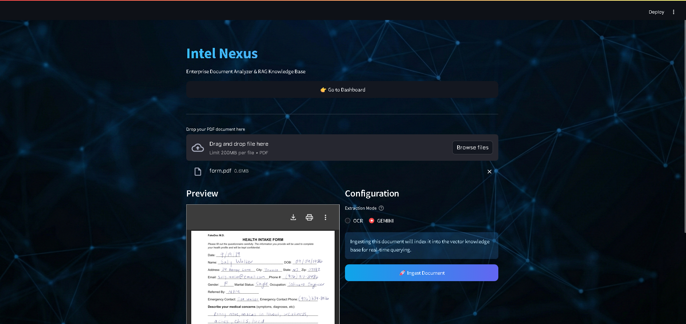
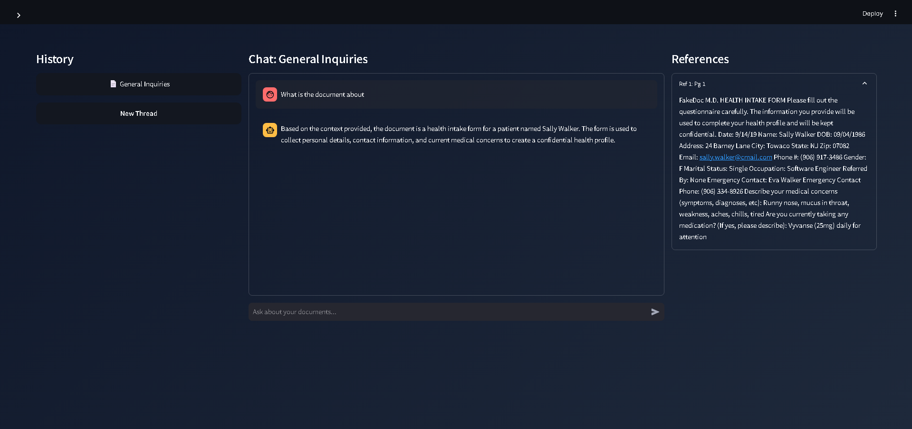
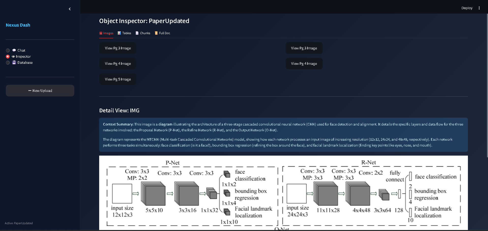
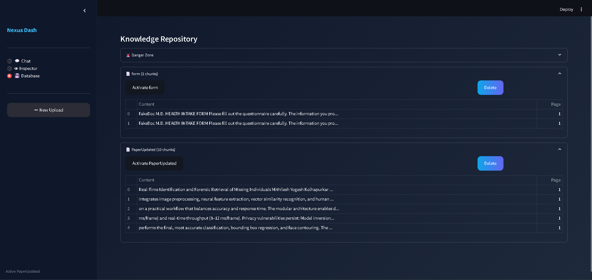

# 🧠 Intel Nexus: Enterprise Document Analyzer

> **A Premium, Agentic Document Intelligence Platform** that combines Traditional OCR with Generative AI Vision.


---

## 👥 Meet the Team

This project was designed and developed by students from **Nutan College of Engineering and Research, Talegaon Dhabade, Pune** under **Intel Unnati Industrail Training 2025 Programme**.
Feel free to connect with us and explore our work!

### 👤 Mithilesh Kolhapurkar  

[](mailto:m.kolhapurkar3529@gmail.com)
[](https://www.linkedin.com/in/mithilesh-kolhapurkar-258001214)

---

### 👤 Ankita Patil  

[](mailto:95ankita.s.patil@gmail.com)
[](https://www.linkedin.com/in/ankita-patil-10b0732ab/)

---

### 👤 Vedant Thorat  

[](mailto:vedantthorat019@gmail.com)
[](https://www.linkedin.com/in/vedant-thorat-156b8628b/)

---

## 🙏 Special Thanks

A huge thank you to our mentor for their guidance, insights, and continuous support throughout the development of this project.

**Prof. Priyanka Vyas**  
[](https://www.linkedin.com/in/priyankavyas6/)

---
## 📸 Snapshots

| Landing Page | Dashboard & Chat |
| :---: | :---: |
|  |  |

| Inspector | Knowledge Base |
| :---: | :---: |
|  |  |

---

## 🎥 Demo Video

▶️ **Watch the full system walkthrough on YouTube**  
👉 https://youtu.be/nZSyUKTinMs

This video demonstrates:
- End-to-end document ingestion
- OCR vs Gemini Vision switching
- Visual RAG responses
- Inspector & Knowledge Base auditing

---

## 🌟 Overview

The **Intel Enterprise Document Analyzer** is designed to solve the "Last Mile" problem of document intelligence: extracting structured data from unstructured, messy real-world PDFs. By dynamically switching between **Tesseract OCR** (for speed) and **Google Gemini Vision** (for reasoning), it achieves high accuracy even on handwritten or complex documents.

[**📘 Read the Full User Guide**](USER_GUIDE.md)  
[**📘 Read the System Architecture**](ARCHITECTURE.md)  
[**📘 Read the API Reference**](API_REFERENCE.md)

### Key Capabilities
- **Hybrid Extraction Engine**: Automatically handles Digital vs. Scanned vs. Handwriting PDFs
- **Deep Artifact Extraction**: Isolates tables into DataFrames and crops images for separate indexing
- **Visual RAG**: Search results provide not just text, but visual "evidence" crops from the original PDF
- **Agentic Inspector**: Dedicated UI to audit every chunk, image, and table found in a document
- **Enterprise-Ready Pipeline**: Modular ingestion, parsing, chunking, embedding, and retrieval

---

## 🚀 Quick Start (Local Development)

### Prerequisites
- **Python 3.9+**
- **Docling OCR**
- **Google Gemini API Key**

### Installation

1. **Clone & Install**
   ```bash
   git clone <repo>
   cd IntelProject
   pip install -r requirements.txt
   
2. Configure API Key

   ```bash
   Copy code
   export GOOGLE_API_KEY="your_api_key"
   # or configure inside backend/config.py
   Run the System (Two Terminals)

3. Backend (FastAPI):

   ```bash
   Copy code
   uvicorn backend.main:app --host 127.0.0.1 --port 8000
   Frontend (Streamlit):
   ```
   ```bash
   Copy code
   streamlit run frontend/app.py
   ```
## 📂 Data Directory Structure (Auto / Manual)

The backend expects the following structure:

   ```
   data/
   ├── processed/
   ├── uploads/
   ├── vectordb/
   └── static/
       ├── images/
       ├── pages/
       └── pdfs/
   ```

Create manually if needed:

   ```
   mkdir -p data/processed \
            data/static/images \
            data/static/pages \
            data/static/pdfs \
            data/uploads \
            data/vectordb
   ```
---

## 🧠 Architectural Highlights

FastAPI Backend: High-performance async API

Streamlit Frontend: Interactive enterprise dashboard

Vector Store: Persistent document embeddings

Vision + Text RAG: Multi-modal retrieval with visual grounding

Inspector Mode: Transparent AI auditing

---

## 🔐 Security & Configuration Notes

API keys are never hardcoded (recommended via environment variables)

Containers run isolated via Docker network

Designed for private VM / enterprise network usage

---

## 📚 Documentation

User Guide
: Detailed walkthrough of features

System Architecture
: Technical deep-dive

API Reference
: Backend endpoints

---

## 📜 License

MIT License

---

## ⭐ If you find this project useful

Give it a star ⭐ and feel free to fork or extend it for research, enterprise pilots, or hackathons.

