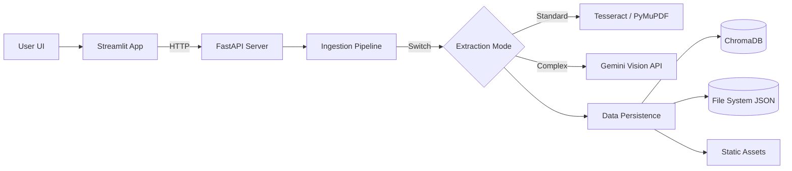

# 🧠 Enterprise Hybrid RAG System

> **A Premium, Agentic Document Intelligence Platform** that combines Traditional OCR with Generative AI Vision to unlock knowledge from complex PDF documents.


## 🌟 Key Features

### 1. Hybrid Extraction Engine
Choose the right tool for the job per document:
- **🟢 OCR Mode (Tesseract)**: Fast, reliable extraction for standard digital or clean scanned documents.
- **🟣 Gemini Vision Mode**: Uses Google's **Gemini 1.5/2.0** Multimodal models to transcribe **handwritten notes**, **complex layouts**, and **noisy scans** with human-level accuracy.

### 2. Intelligent Knowledge Base
- **Vector Search**: Powered by **ChromaDB** and `all-MiniLM-L6-v2` embeddings for semantic retrieval.
- **Deep Artifact Extraction**: Automatically segregates and stores:
  - 🖼️ **High-Res Images**
  - 📊 **Structured Tables** (as DataFrames)
  - 📄 **Text Chunks** with Page Citations

### 3. Premium Web Interface
A modern 3-Panel Agentic UI built with Streamlit:
- **Left Panel**: Ingestion Pipeline & Knowledge Tree Explorer.
- **Center**: Augmented Chat with clickable Source Pills.
- **Right Inspector**: Dedicated Deep-Zoom viewer for checking extraction evidence (Scanned Pages, Crop-outs).
- **Database Inspector**: Full transparency into stored chunks with "Nuclear" reset capabilities.

---

## 🏗️ Architecture

The system follows a modular Microservices-like architecture:



---

## 🚀 Getting Started

### Prerequisites
- **Python 3.9+**
- **Tesseract OCR Engine** (Installed and in system PATH)
- **Google Cloud API Key** (for Gemini Vision features)

### Installation

1. **Clone the Repository**
   ```bash
   git clone https://github.com/your-username/enterprise-rag.git
   cd enterprise-rag
   ```

2. **Install Dependencies**
   ```bash
   pip install -r requirements.txt
   ```

3. **Configure Environment**
   Set your API Key in `backend/config.py` or export it:
   ```bash
   export GOOGLE_API_KEY="your_api_key_here"
   ```

### Running the System

You need to run the Backend and Frontend in separate terminals.

**Terminal 1: Backend API**
```bash
uvicorn backend.main:app --host 127.0.0.1 --port 8000
```
*Server will start at `http://127.0.0.1:8000`*

**Terminal 2: Frontend UI**
```bash
streamlit run frontend/app.py
```
*UI will open at `http://localhost:8501`*

---

## 📂 Project Structure

```text
.
├── backend/
│   ├── modules/          # Core Logic (OCR, Vision, Ingestion)
│   ├── custom_storage/   # Database wrappers (Chroma, JSON)
│   ├── main.py          # FastAPI Entrypoint
│   └── pipeline.py      # Orchestrator
├── frontend/
│   └── app.py           # Streamlit UI
├── data/                 # Data persistence (Created at runtime)
│   ├── vectordb/         # ChromaDB files
│   ├── static/           # Images/PDFs hosted for UI
│   └── processed/        # Metadata JSONs
└── requirements.txt
```

## 🤝 Contributing
See [CONTRIBUTING.md](CONTRIBUTING.md) for how to get involved!

## 📜 License
MIT License. See [LICENSE](LICENSE) for details.
